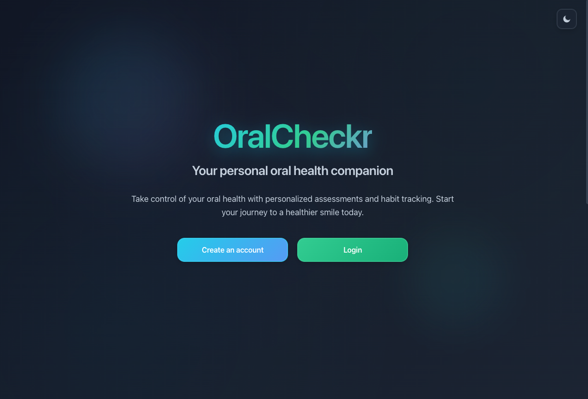
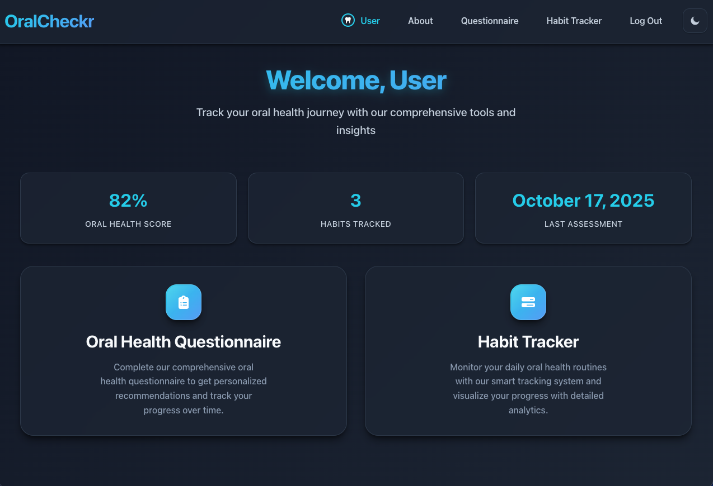
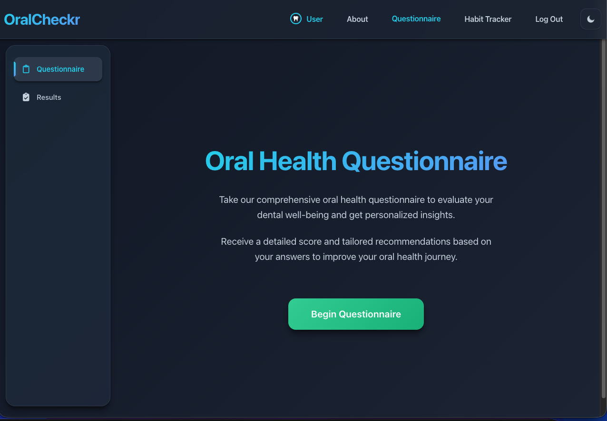
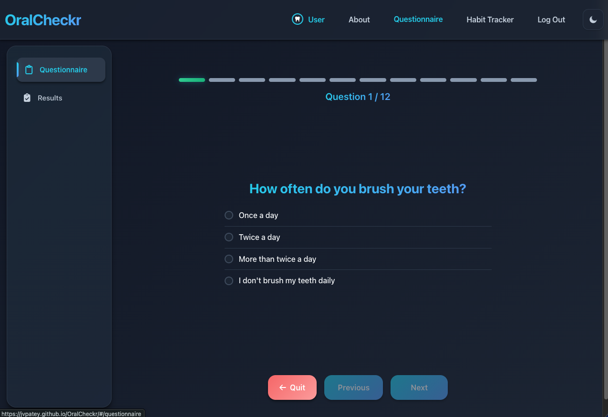
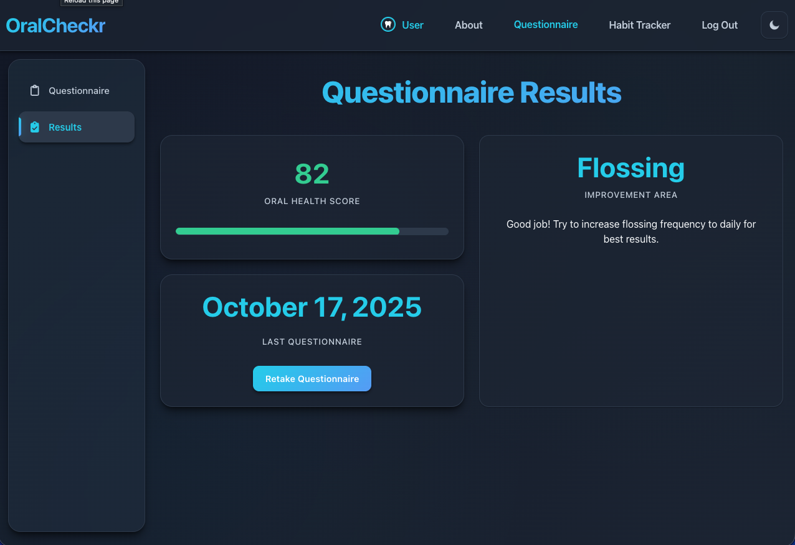
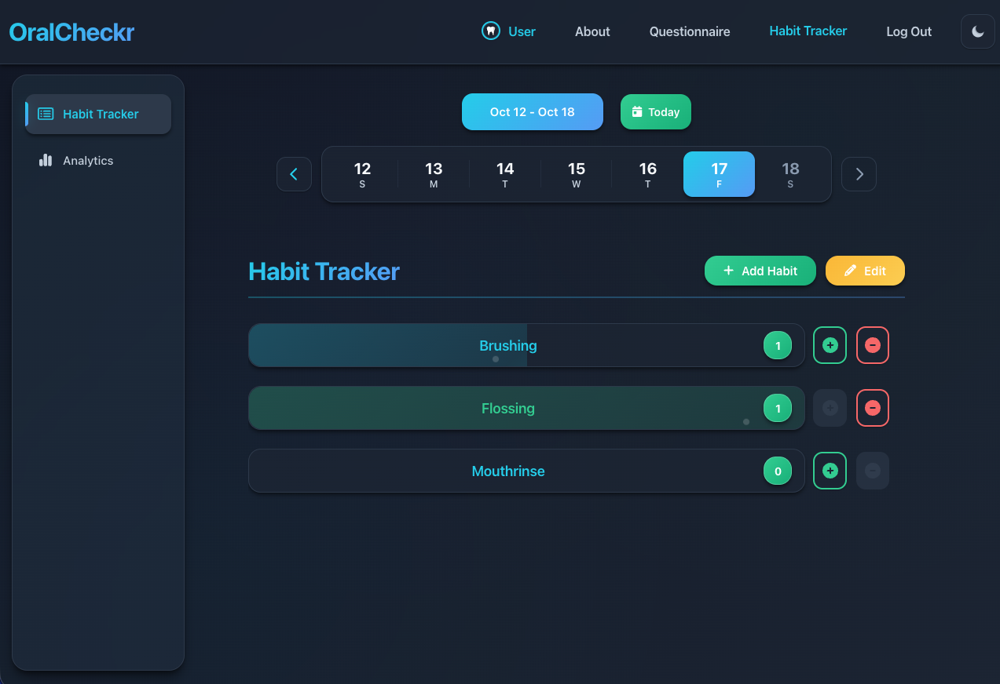
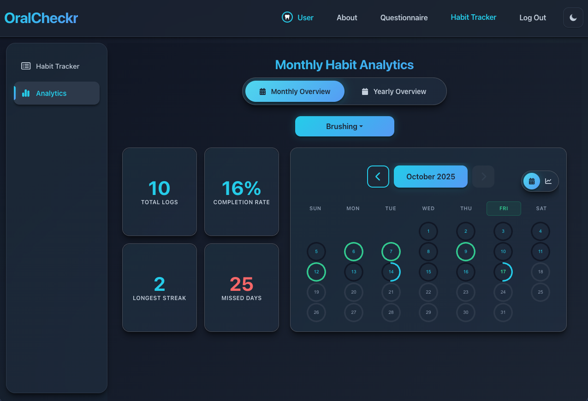
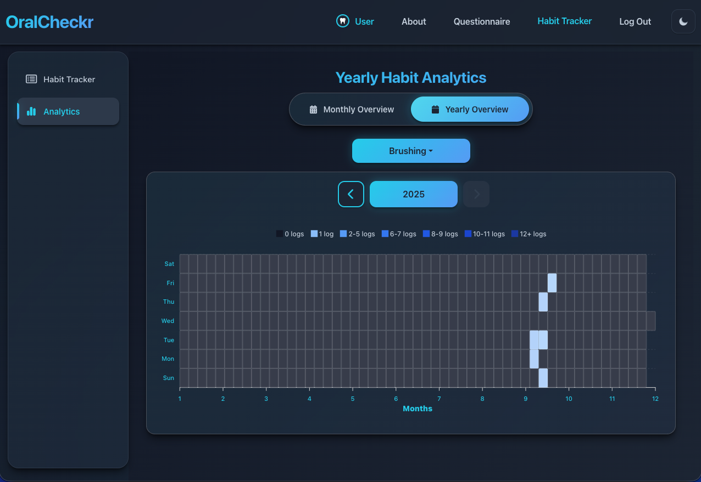
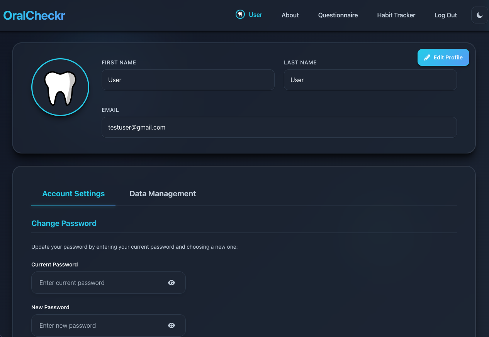

# 🦷 OralCheckr

## 📝 Description

OralCheckr is a comprehensive web application designed to assess and improve your oral health. Through an in-depth questionnaire that covers all aspects of your oral hygiene, the app generates a personalized oral health score and provides tailored recommendations based on your responses. Additionally, OralCheckr includes a powerful habit tracker to help you monitor and maintain your daily oral health habits. With detailed analytics including heatmaps, charts, and statistics, you can track your progress through monthly and yearly insights.

## ✨ Key Features

- **🔐 Flexible Authentication**: Sign up with email/password, Google OAuth, or continue as a guest
- **👤 Guest Mode**: Explore all features without creating an account
- **🔄 Seamless Data Migration**: Guest data automatically transfers when you create an account
- **📊 Oral Health Assessment**: Comprehensive questionnaire with personalized scoring
- **💡 Custom Recommendations**: Tailored oral health tips based on your responses
- **✅ Habit Tracking**: Create and monitor daily oral health habits
- **📈 Advanced Analytics**: Monthly and yearly insights with heatmaps and trend charts
- **👤 User Profile**: Manage your account and track your progress
- **🌓 Theme Toggle**: Switch between light and dark modes
- **📱 Responsive Design**: Beautiful, modern UI that works on all devices

## ✨ Motivation

As a dental hygienist, I wanted to create a tool that helps patients take control of their oral health. OralCheckr combines my background in oral health with technology to provide users with personalized insights and tips. It's designed to help patients track their habits and improve their oral hygiene, making it a valuable tool for education and self-care.

## 🚀 Demo

Try the live application here:

[https://jvpatey.github.io/OralCheckr/](https://jvpatey.github.io/OralCheckr/)

## 📸 Screenshots

### Welcome Page

_Modern landing page with flexible authentication options_



### Dashboard

_Main hub for accessing all features_



### Oral Health Questionnaire

_Comprehensive assessment interface_



### Results & Recommendations

_Personalized oral health score with tailored advice_



### Habit Tracker

_Track daily oral health habits with ease_



### Analytics - Month View

_Detailed monthly statistics and trends_



### Analytics - Year View

_Heatmap visualization of yearly progress_



### User Profile

_Manage your account and preferences_



### About Page

_Learn more about OralCheckr_



## 🛠️ Built with

[](https://skillicons.dev)

**Frontend Technologies:**

- **React 18** with TypeScript for type-safe component development
- **Vite** for lightning-fast development and optimized builds
- **Styled Components** for modern, themeable CSS-in-JS styling
- **React Router** for seamless navigation
- **React Query** (@tanstack/react-query) for efficient data fetching and caching
- **Bootstrap & React Bootstrap** for responsive UI components
- **Google OAuth** (@react-oauth/google) for secure authentication
- **ApexCharts** for beautiful data visualizations
- **React Toastify** for elegant notifications
- **FontAwesome** for comprehensive icon support

## 🛠️ Custom Installation

To run the OralCheckr frontend locally, you'll need to serve the files with a server.
Since it's a React app built with Vite, you can easily start a development server using the following commands:

From this directory (`apps/web`):

```
npm install
npm run dev
```

### Environment Configuration

Create a `.env` file in `apps/web` with the following variables:

```
VITE_API_URL=http://localhost:3000
VITE_GOOGLE_CLIENT_ID=your_google_client_id  # Optional, for Google OAuth
```

### Backend Configuration

The API lives in **`apps/api`** in this monorepo (see the [repository root README](../README.md)).

1. Set up environment variables: create `apps/api/.env` as described in [apps/api/README.md](../api/README.md).

2. Database: Sequelize supports MySQL (typical local dev) and PostgreSQL (production). Tables are created when the server starts.

3. Start the API (from repo root):

   ```
   cd apps/api
   npm install
   npm run dev
   ```

   The server listens on port **3000** by default.

4. Point this app at the API: in `apps/web/.env`, set `VITE_API_URL=http://localhost:3000`.

Note: The backend provides:

- User authentication (traditional email/password, Google OAuth, and guest mode)
- Database storage for user profiles, questionnaires, habits, and habit logs
- RESTful API endpoints for all core functionality
- CORS configuration for secure frontend-backend communication
- Guest-to-user conversion with data migration

## 📋 How to use

### Getting Started:

**Welcome Page:**

- When you first visit OralCheckr, you'll land on the welcome page
- You have three options to get started:
  - **Sign Up**: Create a new account with email and password
  - **Log In**: Access your existing account
  - **Continue as Guest**: Explore all features without creating an account
  - **Sign in with Google**: Quick authentication using your Google account

**Guest Mode:**

- Try out all features without any commitment
- Your progress is saved temporarily
- When you're ready to create an account, all your guest data (questionnaire results, habits, and tracking history) will be automatically transferred to your new account

### Main Features:

**Dashboard:**

- After logging in or continuing as guest, you'll be taken to the dashboard
- The dashboard provides quick access to all main features:
  - Oral Health Questionnaire
  - Habit Tracker
  - Analytics
  - Your Results
- These options are also accessible via the navigation bar

**Questionnaire:**

- On the questionnaire page, click "Begin" to start the assessment
- Navigate through questions covering all aspects of your oral health
- Upon completion, you'll be directed to the results page
- Receive a comprehensive oral health score with personalized recommendations based on your responses
- You can retake the questionnaire at any time to update your score and recommendations

**Habit Tracker:**

- The habit tracker begins with the Habits page, where you can add habits to track
- For each habit, provide:
  - A descriptive habit name
  - Daily goal (how many times per day it should be completed)
- Once added, habits appear as tiles showing:
  - Habit name and daily goal
  - Current progress for the selected date
  - Increment/decrement buttons to log completions
- Features:
  - **Edit Mode**: Modify habit details or delete habits
  - **Date Navigation**: View and manage your habit log history for any date
  - **Quick Actions**: Easily add or remove log entries

**Analytics:**

- Access detailed insights into your habit tracking progress
- **Month View**:
  - Statistics for the selected month
  - Calendar view showing your daily progress
  - Line chart displaying trends over time
  - Streak tracking and completion rates
- **Year View**:
  - Heatmap visualization of your progress throughout the year
  - Compare performance across different habits
  - Identify patterns and areas for improvement

**Profile:**

- Manage your account information
- View your oral health assessment history
- Update personal details
- Access support and FAQs
- Convert from guest to registered user (if applicable)

**Theme Toggle:**

- Switch between light and dark modes using the theme toggle in the navigation bar
- Your preference is saved automatically

**About Page:**

- Learn more about OralCheckr and its mission
- Accessible from the navigation menu or welcome page
